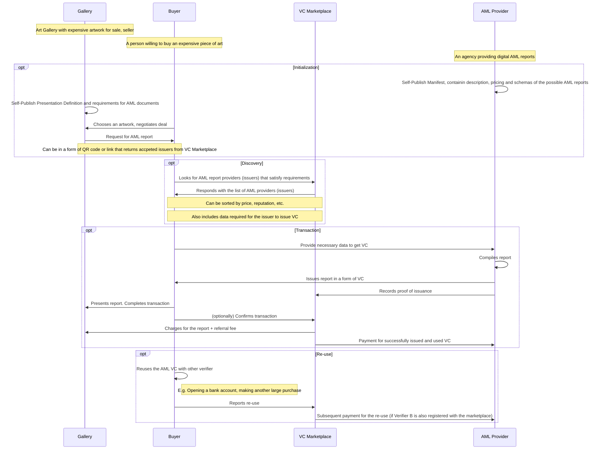
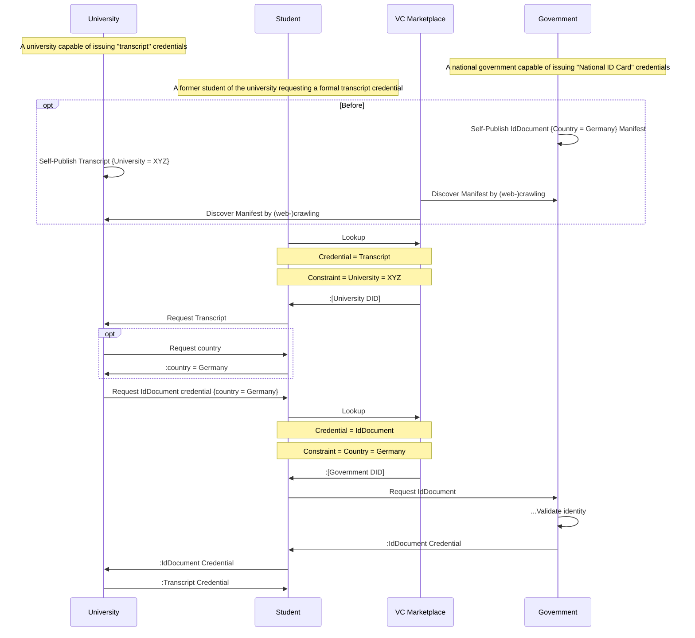

Verifiable Credentials (VC) Marketplace Interfaces
==================

**Specification Status:** Pre-Draft

**Latest Draft:**
[identity.foundation/vc-marketplace](https://identity.foundation/vc-marketplace)
<!-- -->
**Editors:**
~ [Martin Riedel](https://www.linkedin.com/in/rado0x54/) (Consensys Mesh)
~ [Stepan Gershuni](https://www.linkedin.com/in/sgershuni/) (Affinidi)

**Contributors:**

**Participate:**
~ [GitHub repo](https://github.com/decentralized-identity/vc-marketplace)
~ [File a bug](https://github.com/decentralized-identity/vc-marketplace/issues)
~ [Commit history](https://github.com/decentralized-identity/vc-marketplace/commits/master)

------------------------------------

## Abstract

------------------------------------
Work in copy of Hack.md

## Marketplace Use Cases

### Traditional KYC/AML Verification Provider

#### Personas
- **Traditional KYC/AML Provider** that provides Online Verification Services for Service Providers that have to adhere to regulartory requirements.
- **Holder/Subject** of the Credential AND **User** (of the Service Provider)
- **Service Provider** offering an Online Service to its users.

#### Persona Motivations

#### Description
- As an online KYC provider I want to be able to offer my verification service transparently online to Service Providers who require KYCed customers, as well as user directly in order to increase the service usage.
- Technically KYC Credentials can be REUSED until revoked.
- As a KYC Provider I want to be reimbursed for reoccuring usage AND/OR a one-time issuing fee. The one-time issuing fee can be set against the serivce provider redirecting the user to the KYC service OR the user directly.
- As a KYC Provider I want to be able to set a transparent cost basis for the recurring AND/OR one time issuing fee.
- SPECIAL REQUIREMENT: As a service provider I want to be able to have special offers / contracts with service providers that consume my issued credentials.
  - Ideally these "special" conditions are not visible to the general public.
  - E.g. special offers could be models as a "Payback" mechansim outside of the VC Marketplace.
- As a KYC Provider I want to be able to charge for User or Service Provider initated credential revocation (Is that a good motivation?)

#### Sequence Diagram
::: todo Really Important
Add Sequence Diagram for UC.
:::

### Buying a Piece of Art in Switzerland
#### Personas
[[def: VC Marketplace]]:
~ See Abstract.

[[def: Gallery]]:
~ Art Gallery with expensive artwork for sale, seller. Required to ask for AML report by law when large sells are made.

[[def: Buyer]]:
~ A person willing to buy an expensive piece of art.

[[def: AML provider]]:
~ An agency providing digital AML reports.

#### Persona Motivations

#### Description
The use cases provides an example of a workflow where Issuer and Verifier are not aware of each other and in the same time they are willing to get into commercial relationships. This use case describes how VC Marketplace can solve a problem of finding an AML provider and presenting an AML report when making a large purchase. Holder gets the benefit of convinience of making a large purchase; Verifier is able to provide better experience for thier customers and Issuer is able to get a new distribution channel.

#### Sequence Diagram

### Using Employment Credentials to Get a Loan, Rent a House
#### Personas
#### Persona Motivations
#### Description
#### Sequence Diagram

### Requesting an age-gated product at a vending machine
#### Personas
#### Persona Motivations
#### Description
#### Sequence Diagram

### Requesting a university transcript
#### Personas
#### Persona Motivations
#### Description
#### Sequence Diagram

### Discover credential manifest by (web-)crawling
#### Personas
[[def: University, Educational Degree Issuer]]:
~ The University is a federally acknowledged institution that is able to issue educational degrees to its students.

[[def: Student, Transcript Credential Subject and Holder]]:
~ The (former) Student attends or has attended a University and is able to receive a Transcript Credential from the University. Students are also the main Holders of their own educational credentials.
As part of this Use Case the Student is also the Subject of a "National ID Card"

[[def: VC Marketplace]]:
~ See Abstract.

[[def: Government]]:
~ A national government capable of issuing "National ID Card" credentials to its citizens and permanent residents.

#### Persona Motivations

#### Description
This Use-Cases mirrors the Behavior of "Requesting a university transcript" but with initial "Manifest Discovery"
via web-crawling and not by active registration.s

#### Sequence Diagram

### Payment-motivated Use Case
::: todo Really Important
Add UC
- Payment during issuance
- Payment during presentation
:::
#### Personas
#### Persona Motivations
#### Description
#### Sequence Diagram

### Beibehaltungsgenehmigung and Citizenship
::: todo Really Important
TODO @Martin: Add example for Beibehaltungsgenehmigung.
  :::
#### Personas
#### Persona Motivations
#### Description
#### Sequence Diagram

## VC Marketplace Scope (e.g. specifically what is Out of Scope)

## VC Marketplace Interface

### INTERFACE NAME

### INTERFACE DESCRIPTION

### INTERFACE DATA (REQUEST)

### INTERFACE DATA (RESPONSE)

### INTERFACE CONSIDERATIONS

### Issuer: VC / Issuer Validation Process Capability Registration (TODO: What about one to many?)
- A Marketplace is the collection of Issuer-based Credential Manifests
- Issuer Metadata (incl. Reputation information) (WHO!)
    - Issuer self-reported information
    - Collected through crawling
    - Attestations about the Issuer from 3rd parties
- VC Type Metadata (WHAT!)
    - what it's required for? (provided by Verifier)
    - where can get it? (provided by Issuer)
    - price
- What "Issuing Processes" should a Credential Manifest Support (HOW!)
    - Presentation Definition (Requirements are known before, one-time request/response)
    - Other: "Manual": NYC DMV issues digital DL, but only by walking into an office.
    - Other: "Multi-Step" Workflow Verification Process (Delegate)
- Versioning
    - Should the format allow to specify previous versions
    - Should this chain of versions be available to external requesters
- "Issuer Authority":
    - When discovering VC capabilities of an Issuer the Marketplace also discovers "Authority Credentials"
    that are given from higher-level authorities. (E.g. Vaccine Credential, Currency Conversion).
    - Is this "Authority Credential" bound to the Issuer OR Issuer (University) + Credential Type (Degree):
    - This information can be indexed by the Marketplace
      
  
### Further Notes Issuer Registration
- Issuer Service: put it as a service endpoint in DID. Responsibility of the Issuer to host and maintain this information.
- One can image Issuance Use-Cases where a single Action/Process can result in >1 Credential from the Issuer.
  - --> Manifest Binding of Issuer <-> Credential is not ideal for that.
  - 1st Solution: Data format defines Issuing Process --> multiple Credential
  - 2nd Solution: Marketplace is able to programmatically discover credentials from the Issuer that share the same Validation Process (Presentation Definition)
- Marketplace can drive convergance if the usage data for Credential Types is transparent.

#### Call 03.09 — Discovery stage (of VC Issuers & Verifiers?)

Discovery is the responsibility of Marketplace operator / system, rather than every individual issuer / verifier.

What are the options to collect credential data?
- Active registration by the issuer ("triggers crawling of targeted domain").
- Web crawler
- P2P gossip (Would not require participant to be discoverable via DNS).

How the data is stored?
- Registry is just a list of issuer / verifier DIDs, stored in
  - Centralized Registry
  - Decentralized Registry (Blockchain, IPFS, etc.)
- Registry might be useful for payments, where issuers need to specify payment details
- Effcient search through marketplace metadata by maintaining (decentralized) indinces

What goes into metadata?
- Every VC type can have a VC (or VC manifest) describing:
  - Issuer DID
  - Signature
  - Description
  - Verification Process (e.g. Presentation Definition)
    - Credential Type A (Schema URI...)
    - Credential Type B
    - ...
  - Price tag

How do we support updates of metadata?
- Issuer publish DID and then DID service endpoint points to the up-to-date hosted metadata document
- Issuers need a guide of (1) how to publish metadata in a correct way and (2) how to keep it up-to-date along the way

How do we collect vc metadata from the issuers & verifier?
- We need to collect metadata from issuers and keep it open.
- Use structured data to publish the metadata: https://developers.google.com/search/docs/guides/intro-structured-data
  - Can help with adoption as it is a widespread and familiar format
  - The team reponsible for maintaining a website will be able to publish metadata (options: calatog of cred manifests, marketplace-specific data)
  - Crawling can be manual (meaning small marketplace operator can reach out to issuers and ask them to submit links directly)

How Holders discover right issuers / VCs?
- Query VC Marketplace for:
  - Price
  - Issuer
  - ??

How does the VC Issuer Data stay up to date?
- Regular "recrawling" by the Marketplace
- Active notification by the issuer
- Should the dataformat allow for versioning?
- Credential Mapping within a VC Manifest.
  Credential (Type) -> Verification Process (e.g. Presentation Defintion)
  1:1
  Verification Process (Presentation Definition) -> 3x Credential (Type)
  1:n
  Multiple Verification Process -> 1x Credential (DOES NOT MAKE SENSE)
  m:1
  Multiple Verification Process -> Multiple Credentials (DOES NOT MAKE SENSE)
  n:m

#### Why Display and Styling should not be part of a VC Registration Process
- Styling is commonly extracted into a dedicated filestructure format (css, sass)
- Display/Styling requirements will grow and the format requirements will grow.
- Crawlers / Marketplaces / Search Engines would not require this information

### Subject-initiated Issuer-Discovery
Subject trying to discover a VC/Issuer (with certain matched constraints) that can be issued from an issuer?
# TODO.

### Reputation
- Reputation for all entities
#### Notes:
- Should we add Reputation into the Marketplace UC?
- Indepenent of other things all Marketplaces need a standardized interface for issuers to register the Credential Capabilities
- These Capabilities
- Reputation "should be up the Marketplace". E.g. some may use token-based incentive Model. Others might use free market forces ("cheapest"), others might use "traditional web" reputation systems.
- How can an individual query different reputation systems in a standardized way?
- E.g. this group should define a standardized interface to be able to query reputation for a DID?
- 0-100 with the following distribution: normal?
- Marketplace can chose to not expose any reputation score.
- Can Reputation Systems be dynamically integrated into Marketplace implementations (e.g. plugs in external provider.)
- Reputation for Holder/Subject should be out-of-scope.
- Reputation Scope for Marketplace should be limited to Verifier/Issuer.
- For the Holder we might want to have p2p reputation proof
- Can we enable Reputation system with only using VCs but not designing the whole reputation methodology?
- Holder can issue their Reputation VC ad-hoc, compiling from data they already have

### Reporting Credential Issuance (& Payment Coordination)
- Transaction Record (Issuance)
- Start of TX should be recorded (by Issuer)
- Stop (Issuance) of TX should be recorded (Holder)

### Reporting Credential Presentation (& Payment Coordination)
- Transaction Record (Presentation)

### Reporting Credential Revocation (& Payment Coordination)
- Transaction Record (Revocation)

## Cross-sectional concerns

### Marketplace Bootstrapping
- Initial Issuer-Vetting by Marketplace during Registration

### Governance

### Reputation

### Payment (Detail Section)
- Payment is often controversial, however a egalitarian marketplace would be able to drive standardization of Credential Schema and Formats.
- "Traffic" is hidden for general public, but accessible to participants
- Payment "Direct": peer-2-peer Models
- Payment "Indirect": Marketplace coordinatoes or anonomyses transfers. 

### Funding / Incentivation
- Discuss decentralized vs centralized funding models

### Privacy
- Centralized vs Decentralized.

## Discussion & Next Steps
- Not a blueprint f 

## Appendix

- Link to Governance Models
- Link to other work
-

## Discussion Points

### Open Discussion
1. Registration of Verifiers? Collection of Metadata Collection?
- Issuer may want to "block" usage of credentials for certain verifiers: **Consensus: Should not be supported**
- Payment Problem: "A Verifier has a "special price" for consuming certain issuer-credentials." (ideally "hidden"). Privacy Coins.
  - "Cashback" Option.
- Discoverability: @Talk to Stephan

## Subject-initiated Issuer-Discovery
- What does the query look like?
- Incl. Issuer-Based Reputation Score
- Can we use Presentation Exchange

## Meetings
### Meeting Notes 2020/3/30:
- Ticket for UC Migration
- Ticket for Marketplace Terminology
- Centralization vs Decentralization
 - There can be multiple Marketplace operated in different juristiction / associated with different content 
 - Users are free to migrate
- Metamarketplace? Does this spec need to define data sharing between marketplaces.
  - Definition: Standard and Industry Bodies maintain a registry of existing marketplaces.
  - Marketplace could enable easier credential migration from one juristiction to another:
  - If CredentialTypes between jurisdiction are not interoperable there could be authorized
  conversion issuers that allow to migrate Cred A -> Cred B
  - How are several individual "Marketplaces" registered?
  - Compare to DEX (I don't need permission to "onboard to Dex").
  - Decision: Marketplace are no individual entities that need to be registered/identified by a higher
  entity.
  - Challenge: Reputation Migration? Reputation Sharing.
- Incentives for an "open" Marketplace are hard to solve.
- Does this spec need answer "Marketplace Authority"? 

- Outlook: Transfer UC, Write Abstract, Structure "Issuer Discovery Section"

### Meeting Notes 2020/4/7:
#### Topic: Subject-initiated Issuer-Discovery

- Brainstorming Query Properties:
  - Credential
    - CredentialType (single)
    - CredentialType (multiple)
    - Price (per issuance)
    - Price (per usage)
    - Credential Constraints:
      - CredentialType ProofOfCitizenship with value == US
      - CredentialType DriverLicense with value age >= 21
      - Can an Issuer put these constraints into the Credential Manifest?
      - Symmetry between PD and Manifest for representing these contstraints.
  - Issuer
    - by Identifier (unique)
    - by Reputation
    - by Location
    - by Jurisdiction (how?)
    - by Trust Graph (see Notes discussion)
       - Issuers expose "trusted relationships" by VC (Issuer A trust Issuer B)
       - "find all the issuers that are authorized by the DHS"
  - Issuing Process (what's needed to receive the VC)
    - Presentation Defnition
  - Marketplace parameters
    - Ordering of the response
      - Price
      - Issuer / verifier reputation
      - Jurisdiction / compliance rules
      - Trust Graph
  
### Examples
- "I would like to get a credential type X from an Issuer I that was authorized by a credential
  of the German Government with ID Y. (e.g. Issuer has a credential that was issued by the Government)"
  
### Question
- Marketplaces can be curated for any of these properties already, e.g. only containing credentials
of a certain type. "Educational Credential Marketplace".

### Note
- Datastructure: Directed Graph: Vertices are Issuers and Edges are Credentials:
  - Issuer A -> Issuer B ("A authorizes B")
  - Issuer B -> Issuer C ("B authorizes C")
- Are further qualifiers required for that relationship?
  - Compare to PKI structure.
- Do we want to define that VCs.  
- Marketplace maintains a queryable snapshot of that graph.  
- Root of Trust (total trust), Self Issued (no trust), Reputation System (continuous)

## Meeting Notes 4/13/2021

### IIW Presentation
- Discuss Issuer relationship model (see previous section)
- Presentation team: Martin, Ravikant, (if needed) Stepan
- https://internetidentityworkshop.com/schedule/ (Apr 20-22)

### Refining Query Properties
- How do we effectively query mutliple credentials?
  - They are linked by the issuer process defined in the Credential Manifest
- What should be the response of the Marketplace?
  - Ordered list of matches
    - Who controls the ordering? Should be users ultimately in charge
  - Individual Match:
    - Issuer metadata (location, reputation, etc.)
    - Credential metadata (price, type, etc.)

- Open question: do we need to specify issuance process? if so, is it only Presentation Def. or also offline / not VC-based process as well?

### VC Marketplace business models
- Credential Issuance: one-time payment ($: H -> I)
- Credential Presentation: per use payment ($: V -> I)
- Credential Presentation: holder has VC, how can she monetize it? ($: V -> H)
  - who is getting paid in this last case (subject or holder)?
  - how is price negotiation happening (p2p, thru marketplace)?

## Meeting Notes 4/27/2021

- Next Steps for this Group:
  - Martin: Finish Specification with the unstructured content that was currently discussed
  - Stepan: IIW32 has shown that Reputation is the big ask, but a useable model is still far out.
  - Stepan: In a fully decentralized Marketplace implementation, the spec does not answer any Governance questions.
  - Add "Appendix" to Marketplace around possible Governance models (Proof of Authority, Proof of Work, Staking, ...)
    - Governance Model is abstracted behind "Controller DID", Control of that DID/Keys are implemented in a governance model.
    - https://wiki.trustoverip.org/display/HOME/GSWG+Trust+Assurance+Task+Force
  - Add "Appendix" to Marketplace around possible Trust / Reputation Models
    - E.g. "Issuer Trust Graph" with Root of Trust, Whitelisting by Marketplace operator, Other Marketplace system. Externalic

